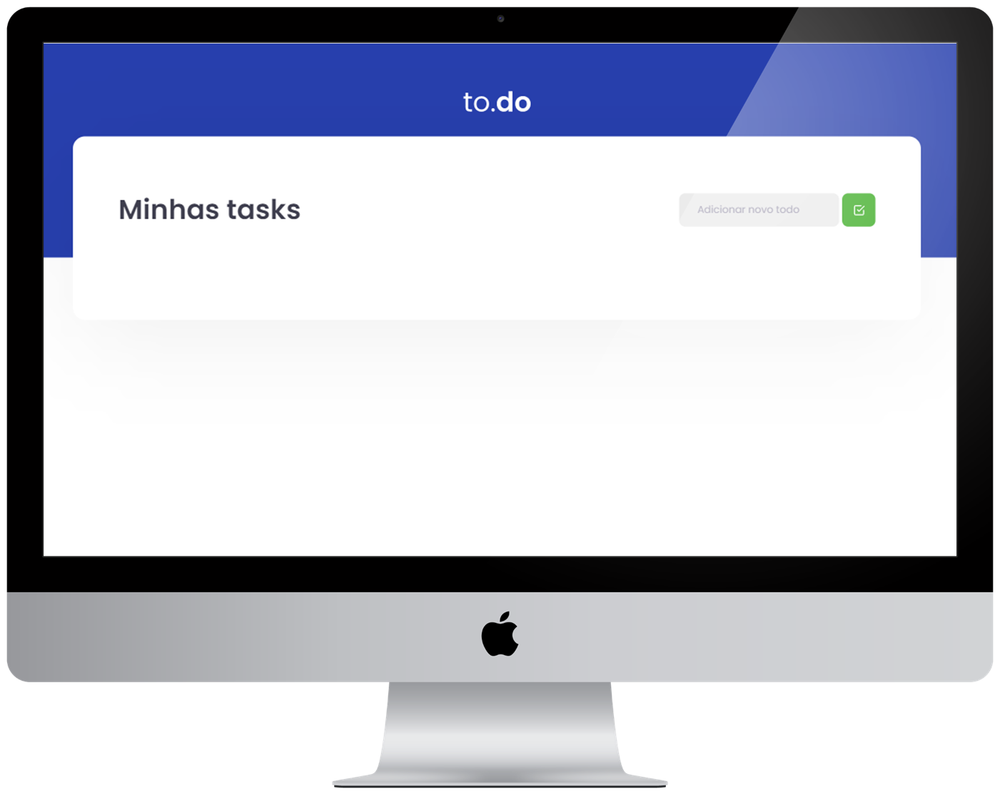

<h1 align="center">
    
</h1>

<p align="center">
  <a href="#-projeto">Projeto</a>&nbsp;&nbsp;&nbsp;|&nbsp;&nbsp;&nbsp;
  <a href="#-ambiente">Ambiente</a>&nbsp;&nbsp;&nbsp;|&nbsp;&nbsp;&nbsp;
  <a href="#%EF%B8%8F-licença">License</a>&nbsp;&nbsp;&nbsp;
</p>
<br>

<p align="center">
  
</p>
<br>

<p align="center">
 
</p>

## 💻 Projeto

Primeiro desafio realizado no curso Ignite da [Rocketseat](https://rocketseat.com.br/).

Após clonar o template, era necessário fazer a logica de três funcionalidades entre ela:

Adicionar um tarefa.
Selecionar tarefa por um ID.
Excluir tarefa por um ID.

## 📝 Ambiente

1. Clonar o repositório:

```bash
git@github.com:CaioLemec/desafio-react01-ignite.git
```

2. Instale as dependências usando o comando:

```bash
 yarn
```

3. No seu terminal use o comando:

```bash
yarn dev
```

4. acesse o endereço em um browser compatível:

```bash
http://localhost:8080/
```

## ⚖️ Licença

Projeto licenciado por MIT [LICENSE](./LICENSE).
